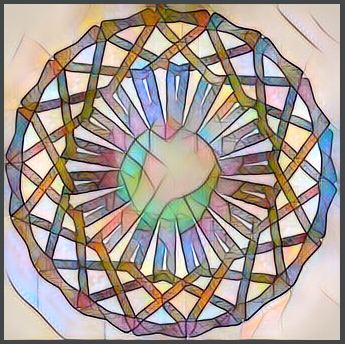

This repo contains code and instructions to support Neural Style Transfer in Kojo.

Neural Style transfer in Kojo is based on [PyTorch](https://pytorch.org/) and builds upon the [fast neural style](https://github.com/pytorch/examples/tree/master/fast_neural_style) example in the PyTorch examples repo.

## Instructions to get going
*Note - the instructions are for Linux, for now. A similar set of steps should also work for Windows or Mac.*

* Install PyTorch using [miniconda](https://docs.conda.io/en/latest/miniconda.html)
  * Install miniconda
  * `conda create --name pytorch`
  * `conda activate pytorch`
  * `conda install pytorch torchvision cpuonly -c pytorch`
* Install [JEP](https://github.com/ninia/jep)
  * `sudo apt install build-essential`
  * Download JDK from `https://github.com/AdoptOpenJDK/openjdk8-binaries/releases/download/jdk8u242-b08/OpenJDK8U-jdk_x64_linux_hotspot_8u242b08.tar.gz` 
  * Extract the JDK into, say, `jdk_dir`.
  * `export JAVA_HOME=<jdk_dir>`
  * `pip install jep==3.9.0` in the `pytorch` conda environment activated above.
* `git clone https://github.com/litan/kojo_neural_style.git` under, say, `~/work`.
* `cp ~/work/kojo_neural_style/libk/jep-3.9.0.jar ~/.kojo/lite/libk`
* `mkdir ~/kojo-includes`
* `cp ~/work/kojo_neural_style/include/neural-style.kojo ~/kojo-includes`
* Add the following line (suitably adapted) to ~/.kojo/lite/kojo.properties  
`library.path=/home/lalit/miniconda3/envs/pytorch/lib:/home/lalit/miniconda3/envs/pytorch/lib/python3.8/site-packages/jep`

At this point, you are good to go ;).

Here's an example (using [Kojo Pictures, filters, and effects](http://docs.kogics.net/tutorials/pictures-intro.html)):
```scala
// #include ~/kojo-includes/neural-style.kojo
NeuralStyle.root = "/home/lalit/work/kojo_neural_style"
val styleModelDir = s"${NeuralStyle.root}/neural_style/saved_models"
val mosaicModel = s"$styleModelDir/mosaic.pth"
val udnieModel = s"$styleModelDir/udnie.pth"

cleari()
val fltr1 = new NeuralStyleFilter(mosaicModel)
val fltr2 = new NeuralStyleFilter(udnieModel)

val drawing = Picture {
    setPenColor(black)
    setPenThickness(10)
    repeat(18) {
        repeat(5) {
            forward(100)
            right(72)
        }
        right(20)
    }
}

val pic = effect(fltr2) * effect(fltr1) -> drawing
draw(pic)
```



